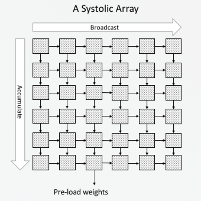
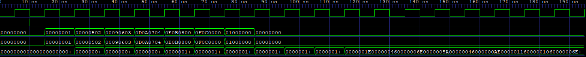
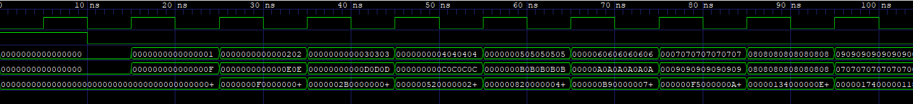
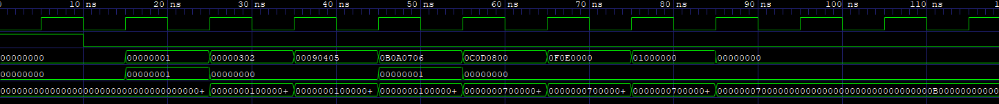

# Systosim : Systolic Array Simulator


**Systosim** is a Verilog-based hardware simulation of a **Systolic Array** — a specialized architecture designed for high-speed Matrix Multiplication. This logic is a foundational component of modern AI accelerators, such as Google’s TPU, designed to handle massive computational workloads with high efficiency.

## 🧠 Core Definitions

### What is a Systolic Array?

A Systolic Array is a network of processors that "pumps" data through the system in a synchronized, heartbeat-like fashion. Unlike traditional architectures where a CPU constantly fetches data from memory (creating a bottleneck), a systolic array reuses data as it flows from one processor to its neighbor. This significantly reduces memory bandwidth requirements and boosts throughput.

### What is a Processing Element (PE)?

The PE is the fundamental unit of the array. In this project, each PE is a **Multiply-Accumulate (MAC)** unit. Every clock cycle, it:

1. Receives two numbers: one from the **Left** (Input 1) and one from the **Top** (Input 2).
2. Multiplies them and adds the result to an internal register (**mac_out**).
3. Forwards the original values to the **Right** and **Bottom** neighbors for their own calculations.




---

## 📁 File Structure :

```
├── assets/                                    
│   ├── matmul_4x4.png                         # 4x4 simulation waveform screenshot
│   ├── matmul_NxN.png                         # NxN simulation waveform screenshot
│   ├── convolution.png                        # 2D Convolution waveform screenshot
│   └── systolic_array.png                     # Architectural block diagram
├── rtl/                                       
│   ├── matmul_4x4/                            # Structural 4x4 implementation
│   │   ├── pe.v                               # Processing Element (MAC unit)
│   │   └── systolic_array.v                   # Manually wired 4x4 grid
│   ├── matmul_NxN/                            # Parameterized implementation
│   │   ├── pe.v                               # Processing Element (MAC unit)
│   │   └── systolic_array.v                   # N-sized grid logic (generate loops)
│   └── convolution/                           # Im2Col Convolution mapping
│       ├── pe.v                               
│       └── systolic_array.v                   
├── sim/                                      
│   ├── matmul_4x4_sim/                       
│   │   ├── matmul_4x4_wave.vcd                # 4x4 Waveform data
│   │   └── systolic_array.vvp                 # Compiled 4x4 Icarus Verilog executable
│   ├── matmul_NxN_sim/                       
│   │   ├── matmul_NxN_wave.vcd                # NxN Waveform data
│   │   ├── matrix_a.txt                       # Input data for Matrix A
│   │   ├── matrix_b.txt                       # Input data for Matrix B
│   │   └── systolic_array.vvp                 # Compiled NxN Icarus Verilog executable
│   └── convolution/                           
│       ├── convolution_wave.vcd               # Convolution Waveform data
│       └── systolic_array.vvp                 # Compiled Convolution Icarus Verilog executable
├── tb/                            
│   ├── systolic_array_matmul4x4_tb.v          # 4x4 Matrix Multiplication Verilog Testbench
│   ├── systolic_array_matrmulNxN_tb.v         # NxN Matrix Multiplication Verilog Testbench
│   └── systolic_array_convolution_tb.v        # 2D Convolution Verilog Testbench
├── LICENSE                                    # MIT License
└── README.md                                  # Project documentation
```

---

## 🏗️ Implementations :

### 1. 4x4 Structural Grid (`rtl/matmul_4x4`)

This version is built using explicit structural modeling.

* **The Logic:** Every single wire and PE instance (`pe_00` through `pe_33`) is manually defined and connected.
* **Why use it?** It is designed for maximum transparency. It is the best starting point for understanding the physical layout of the hardware and tracing how signals propagate through a fixed grid.

### 2. NxN Parameterized Grid (`rtl/matmul_NxN`)

This version leverages Verilog `generate` blocks and `parameters` to create a flexible design.

* **The Logic:** By simply adjusting the `parameter N`, the compiler automatically instantiates the correct number of PEs and routing wires.
* **Why use it?** It demonstrates scalable, industry-standard RTL design. It uses an 1D output bus to store results, mapped via the formula:
`result[32*(N*N - 1 - (i*N + j)) +: 32]`

### 3. 2D Convolution via Im2Col (`rtl/convolution`)

This version demonstrates how to map a sliding-window 2D Convolution onto a fixed Matrix Multiplication hardware array without altering the underlying RTL.

* **The Logic:** By using the **Image-to-Column (Im2Col)** technique, image patches are flattened into rows, and the convolution kernel is flattened into a column. The hardware calculates the dot product natively, outputting the correct Feature Map.
* **Why use it?** It proves that complex AI operations like convolution can be executed efficiently on a systolic array, mimicking how modern AI compilers map software algorithms to hardware accelerators.

---

## 🚀 Getting Started

### Prerequisites

You will need **Icarus Verilog** for compilation and **GTKWave** for viewing timing diagrams.

### Running the 4x4 Simulation

```bash
# Compile from root
iverilog -o sim/matmul_4x4_sim/systolic_array.vvp rtl/matmul_4x4/systolic_array.v tb/systolic_array_matmul4x4_tb.v

# Run simulation
vvp sim/matmul_4x4_sim/systolic_array.vvp

```

### Running the NxN Simulation

```bash
# Compile from root
iverilog -o sim/matmul_NxN_sim/systolic_array.vvp rtl/matmul_NxN/systolic_array.v tb/systolic_array_matmulNxN_tb.v

# Run simulation
vvp sim/matmul_NxN_sim/systolic_array.vvp

```

### Running the 2D Convolution Simulation

```bash
# Compile from root
iverilog -o sim/convolution/systolic_array.vvp rtl/convolution/systolic_array.v tb/systolic_array_convolution_tb.v

# Run simulation
vvp sim/convolution/systolic_array.vvp

```

---

## ⏳ Data Skewing (The Timing)

In a systolic array, data cannot be fed all at once. Because each PE introduces a 1-cycle delay, the inputs must be **skewed** in a "staircase" pattern:

* Row 0 enters at Cycle 1.
* Row 1 enters at Cycle 2.
* Row 2 enters at Cycle 3.

This ensures that the correct elements of Matrix A and Matrix B meet at the correct PE at the exact same time.

---

## 📈 Waveform Analysis

After running the simulations, use GTKWave to inspect the `.vcd` files. These waveforms provide a visual "heartbeat" of the hardware.

### 4x4 Waveform

Observe the `a`, `b`, and `result` bus for 4x4 Matrix Multiplication :



### NxN Waveform

Observe the `a`, `b`, and `result` bus for NxN Matrix Multiplication (N = 8) :



### Convolution Waveform

Observe the `a`, `b`, and `result` bus for 2D Convolution :



---

## ✅ Validation Results

### 4x4 Matrix Multiplication 

The testbenches verify the hardware. For the 4x4 setup, the array successfully computes:

* **Top-Left Corner (0,0):** 30
* **Bottom-Right Corner (3,3):** 591
* **Maximum Result Value:** 591

### NxN Matrix Multiplication 

The testbenches verify the hardware. For the NxN setup, the array successfully computes:

* **Top-Left Corner (0,0):** 372
* **Bottom-Right Corner (7,7):** 372
* **Maximum Result Value:** 1016

### 2D Convolution

The testbenches verify the hardware. For the 2D Convolution setup, the array successfully computes:

* **Top-Left Corner (0,0):** 7
* **Top-Right Corner (0,1):** 11
* **Bottom-Left Corner (1, 0):** 23
* **Bottom-Right Corner (1,1):** 12

---

## 🛠️ To-Do List

* [✅] 4x4 Structural MatMul
* [✅] NxN Parameterized MatMul
* [✅] 2D Convolution

---

## 📜 License

Distributed under the MIT License.

---